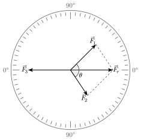
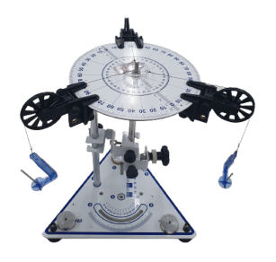
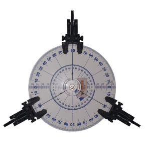

## Introdução

Conforme @Halliday1, a força é uma grandeza vetorial, ou seja, além de possuir intensidade, também apresenta direção e sentido. Quando duas forças $F_1$ e $F_2$ atuam sobre um mesmo ponto, o efeito combinado não é dado por uma simples soma algébrica, mas pela soma vetorial. A resultante $F_r$ dessas duas forças pode ser obtida pela *regra do paralelogramo*, na qual os vetores $F_1$ e $F_2$ formam os lados adjacentes de um paralelogramo e a diagonal representa a resultante.


```{=typst}
#figure(
  image("assets/images/typst/forcas-em-equilibrio.pdf", width: 50%),
  caption: [Sistema de Forças em equilíbrio estático]
)<fig-forcas-em-equilibrio>
```

::: {.content-visible when-format="html"}
{#fig-forcas-em-equilibrio width=50%}
:::

Matematicamente, para duas forças que formam um ângulo $\theta$, o módulo da resultante é dado por:

```{=typst}
$
  F_r = sqrt(F_1^2 + F_2^2 + 2 F_1 F_2 cos theta)
$<eq-paralelogramo>
```

::: {.content-visible when-format="html"}
\begin{equation}
  F_r = \sqrt{F_1^2 + F_2^2 + 2 F_1 F_2 \cos \theta}\label{eq-paralelogramo}
\end{equation}
:::

Para que o sistema esteja em equilíbrio, é necessário aplicar uma terceira força $F_3$, de mesmo módulo que a resultante $F_r$, porém de sentido oposto: $\vec{F_3} = -\vec{F_r}$.

Esse princípio tem diversas aplicações práticas, como no cálculo de forças em cabos de pontes e estruturas, na análise de forças que atuam sobre um corpo suspenso por fios em diferentes direções, e no equilíbrio de objetos submetidos a tensões em máquinas simples. 

```{=typst}
#subpar.grid(
  figure(image("assets/images/kit-mesa-de-forca_1.png"), caption: figure.caption(position: bottom)[
    Aparato experimental.
  ]), <fig-mesa-a>,
  figure(image("assets/images/mesa-de-forca-120_1.png"), caption: figure.caption(position: bottom)[
    Posição de equilíbrio.
  ]), <fig-mesa-b>,
  columns: (5fr, 5fr),
  caption: [Mesa de Forças.],
  label: <fig-mesa>,
)
``` 

::: {.content-visible when-format="html" #fig-mesa layout-ncol=2}

{#fig-mesa-a}

{#fig-mesa-b}

Mesa de Forças.
:::

O experimento da mesa de forças, ilustrado na @fig-mesa permite compreender de forma visual e prática como a soma vetorial se manifesta no mundo real e como o conceito de equilíbrio está diretamente ligado ao princípio da adição de vetores.

## Objetivos

Apresente de forma clara e objetiva o que se pretende alcançar com a atividade experimental, utilizando verbos de ação como

1. Compreender que a força é uma grandeza vetorial;
2. Aplicar a *regra do paralelogramo* para determinar a resultante de um par de forças;
3. Determinar experimentalmente o valor de uma força que equilibra duas outras forças;
4. Determinar graficamente a resultante de duas forças pela regra do paralelogramo.

## Material necessário

- Mesa de forças composta por um transferidor de ângulos e base de fixação;
- 03 polias móveis;
- Conjunto de massas e suportes;
- Fios.


:::: {.content-visible when-format="html"}
## Referências

:::{#refs}
:::
::::


```{=typst}

= Procedimentos

#info-box([Atenção], [
  - Cada suporte tem massa de 5 gramas.
  - Para simplificação dos cálculos, utilizaremos o grama-força (gf) como unidade de força para medida das tensões nos fios. _Lembre-se_: 1 grama-força (1gf) é a força peso de uma massa de 1 grama (1 g).
])


+ Monte a mesa de forças conforme mostrado na @fig-mesa-a. Duas para as forças que serão somadas ($F_1$ e $F_2$) e a terceira polia para a força $F_3$ que equilibra as demais.
+ Organize os conjuntos de massa + suporte em três grupos, cada um com massa total igual a *40 g*: 

  #set math.equation(numbering: none)
  $
    m_1 = 40 " g;" m_2 = 40 " g; e " m_3 = 40 " g"
  $
+ Passe os fios sobre as polias e prenda as massas nas extremidades.
+ Fixe uma das polias na marcação de 0º no transferidor da mesa de forças. A massa acoplada, que corresponderá à massa $m_3$, e a posição dessa polia não serão alteradas durante a execução do experimento.
+ Por tentativa e erro, ajuste posição das outras duas polias (para $m_1$ e $m_2$) de modo que o sistema fique em equilíbrio (O sistema estará em equilíbrio quando o disco transparente ficar centralizado em relação à mesa de força, conforme @fig-mesa-b.).
+ Anote o ângulo $theta$ formado pelos fios ligados às massas $m_1$ e $m_2$ no campo correspondente da @tab-dados.
+ Aplique a @eq-paralelogramo e determine a Força resultante $F_r$ esperada que equilibraria as forças $F_1$ e $F_2$ com um ângulo $theta$.
+ Represente as forças $F_1$, $F_2$ e $F_3$ no diagrama apropriado do #text(fill: primary-color)[Anexo - Análise Gráfica]. Use a regra do paralelogramo para determinar graficamente a força $F_r$.
+ Repita os passos acima para os ternos de massas $m_1$, $m_2$ e $m_3$ na @tab-dados.

#figure(
  kind: table,
  caption: [Coleta e análise de dados],
)[
  #table(
    columns: (1fr, 1fr, 1fr, 2fr, 2fr, 2fr),
    table.header([$F_1$ (gf)], [$F_2$ (gf)], [$F_3$ (gf)], [$theta (°)$], [$F_r$ (gf)], [$E (%)$]),
    [40], [40], [40], [], [], [],
    [35], [35], [40], [], [], [],
    [25], [35], [40], [], [], [],
  )
]<tab-dados>


= Análise de Dados

#info-box([Atenção], [

  Vamos avaliar a qualidade do experimento por meio do cálculo do erro percentual:
  $
    "E (%)" = frac(|F_3 - F_r|, F_r) dot 100 %
  $<eq-erro>
])

#set enum(start: 1)
+ Usando a @eq-erro, calcule o erro percentual $"E (%)"$ na determinação da força resultante de cada distribuição de massas. Anote o resultado na coluna correspondente da @tab-dados.

+ A análise gráfica permite concluir que a relação $arrow(F_3) = -arrow(F_r)$ é verdadeira? Explique as causas de possíveis erros.


#set heading(numbering: none)
= Referências

#bibliography("assets/references/references.bib", style: "assets/references/abnt.csl", title: none)


#pagebreak()
#set page(paper: "a4", flipped: true)

#place(
  top + center,
  float: true,
  scope: "parent",
  clearance: 1em,
)[
  #par(justify: false)[
    #text(fill: primary-color)[*ANEXO - ANÁLISE GRÁFICA*]
  ]
]

#let transferidor = {
  cetz.canvas({
    import cetz.draw: *
    let raio = 6.4cm
    circle((0,0), radius: raio)
    for i in range(360) {
      let a=0.95
      if calc.rem(i, 10)==0 {
        a = 0.87
      } else if calc.rem(i, 5)==0 {
        a = 0.9
      } else {
        a = 0.94
      }

      line(
        (a*raio*calc.cos(i * calc.pi/180), a*raio*calc.sin(i * calc.pi/180)),
        (raio*calc.cos(i * calc.pi/180), raio*calc.sin(i * calc.pi/180)),
        stroke: (thickness: 0.5pt)
      )
    }

    for i in range(12) {
      let ang = 30deg * i
      let r = 4cm
      line((0,0),
        (r * calc.cos(ang), r * calc.sin(ang)),
        stroke: (thickness: 0.5pt, dash: "dashed"), 
      )
    }

    for i in range(10) {
      let ang = 10 * i
      let a = 0.82
      content(
        (a*raio*calc.cos(ang * calc.pi/180), a*raio*calc.sin(ang * calc.pi/180)), [#ang]
      )
      content(
        (a*raio*calc.cos(ang * calc.pi/180), a*raio*calc.sin(-ang * calc.pi/180)), [#ang]
      )
      content(
        (a*raio*calc.cos((180-ang) * calc.pi/180), a*raio*calc.sin(ang * calc.pi/180)), [#ang]
      )
      content(
        (a*raio*calc.cos((180-ang) * calc.pi/180), a*raio*calc.sin(-ang * calc.pi/180)), [#ang]
      )
    }

    for r in (2.5cm, 3.5cm, 4cm) {
      arc(
        (r*calc.cos(95deg),r*calc.sin(95deg)), start: 95deg, stop: 445deg, radius: r, stroke: (thickness: 0.5pt)
      )
      let label = $#str(10 * r / 1cm)$
      content(
        (0, r), [#box(fill: white)[$#label$]]
      )
    }
  })
}

#let header(f1, f2, f3) = {
  set table(
    stroke: (x, y) => if y == 0 {
      (top: 0.7pt + primary-color)
      (bottom: 0.7pt + primary-color)
      if x > 0 {
        (left: 0.7pt + primary-color)
      }
    } else {
      (bottom: 0.7pt + primary-color)
      if x > 0 {
        (left: 0.7pt + primary-color)
      }
    },
    fill: (x, y) => if y == 0 {
      primary-color.transparentize(60%)
    } else {
      if calc.even(y) {
        primary-color.transparentize(80%)
      }
    }
  )
  show table: set text(size: 10pt)
  show table.cell.where(y: 0): strong
  table(
    columns: (1fr, 1fr, 1fr),
    table.header([$F_1$ (gf)], [$F_2$ (gf)], [$F_3$ (gf)]),
    [#f1], [#f2], [#f3]
  )
}

#set align(center)
#set table(
  fill: white,
  stroke: (x, y) => if x==0 {
    (right: 0.6pt+primary-color)
  }
)
#table(
  columns: (13.75cm, 13.75cm),
  align: horizon,
  inset: 0.2cm,
  [
    #header(40, 40, 40)
  ], [
    #header(35, 35, 40)
  ],
  [
    #transferidor
  ],
  [
    #transferidor
  ]
)

#pagebreak()
#table(
  columns: (13.75cm, 13.75cm),
  align: horizon,
  inset: 0.2cm,
  [
    #header(25, 35, 40)
  ], [],
  [
    #transferidor
  ],
  []
)

```